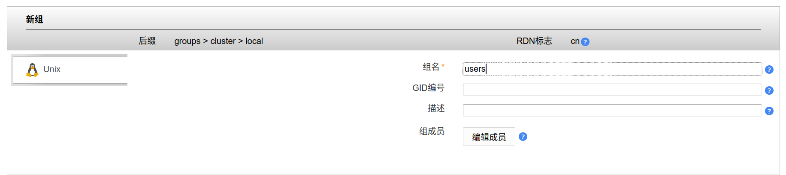
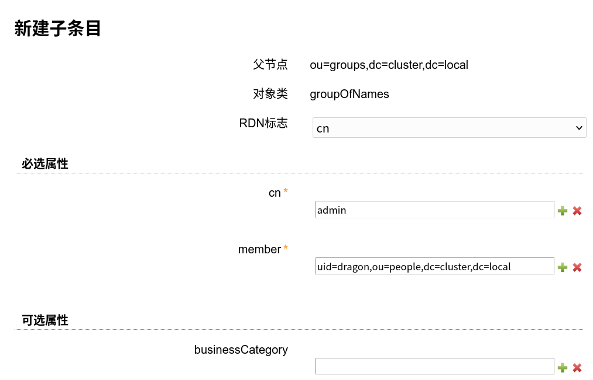

= 部署 LDAP 管理器
:experimental:
:icons: font
:toc: right
:toc-title: 目录
:toclevels: 4
:source-highlighter: rouge

== 说明

此项目使用 `ldapaccountmanager` 作为 LDAP 管理器。此项目依赖镜像 `ldapaccountmanager/lam:8.0.1` 。

== 创建 Deployment

使用以下配置创建关联的 `Deployment`。

[source%linenums,yaml]
----
include::./conf/01-lam-deploy.yaml[]
----

创建完成后使用 `kubectl get pods -n core-system` 查看创建结果。

=== 创建 Service

使用以下配置创建 Service ，关联之前创建的 Deployment。

[source%linenums,yaml]
----
include::./conf/02-lam-service.yaml[]
----

创建完成后使用 `kubectl get svc -n core-system` 查看创建结果。

=== 绑定 Ingress

导入此配置，绑定 Ingress, 将 LAM 映射到外部地址。注意：里面标注的内容请按照实际情况修改。

[source%linenums,yaml]
----
include::./conf/03-lam-ingress.yaml[]
----

. 其中
<1> 指定 Ingress 暴露的 Host
<2> 指定 Ingress 使用的 TLS 证书 secret 名称
<3> 指定 Ingress 使用的 Host
<4> 指定 Ingress 绑定的 Service

== 验证

访问地址 `https://lam.d7z.net` , 使用 LDAP 配置的管理员密码登陆，如果登陆成功则表明安装正确。

TIP: 在测试时，你需要将 `lam.d7z.net` 改为实际的地址

== 初始化配置

=== 创建OU

访问 `https://lam.d7z.net` ，输入管理员密码登陆后可看到如下页面：

image::images/01-create-ou.png[]

点击建立即可。

=== 创建默认角色

前往地址 `https://lam.d7z.net/lam/templates/lists/list.php?type=group`，点击创建新组，按如下所示输入保存即可。

=== 创建管理员用户

前往地址 `https://lam.d7z.net/lam/templates/lists/list.php?type=user` ，点击创建新用户，同时配置密码，按如下所示输入保存即可。注意 RDN 标志需配置为 `UID` 。

image::images/03-create-adm.png[]

=== 创建管理员角色

前往 `https://lam.d7z.net/lam/templates/tools/treeView.php` 页面，在 `ou=groups` 下方新建 `groupOfNames` 对象，按如下所示输入保存即可。

TIP: 后续相关角色创建流程均参考此流程即可。
