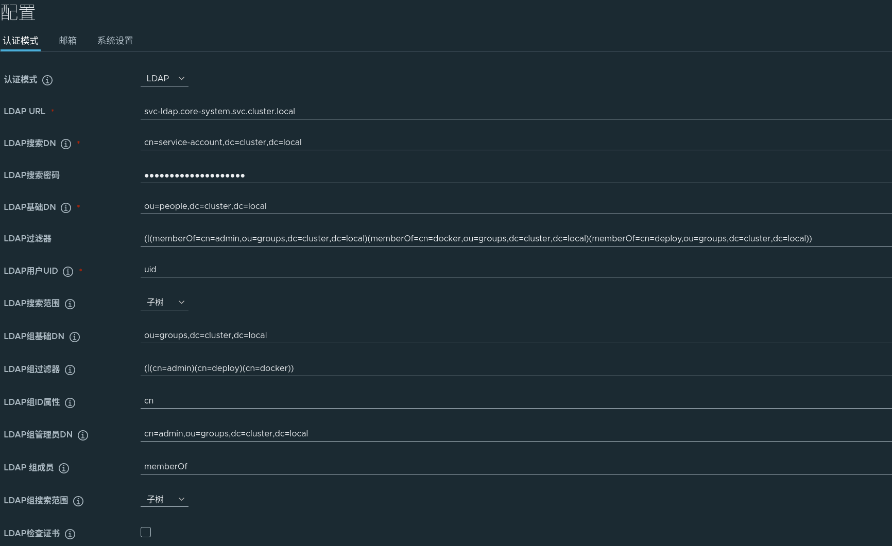

= Harbor 部署
:experimental:
:icons: font
:toc: right
:toc-title: 目录
:toclevels: 4
:source-highlighter: rouge

== 说明

=== 前置条件

- *Postgres* : **Harbor** 需要 Postgres 数据库才可正常工作
- *LDAP*：*Harbor* 将使用 *LDAP* 统一管理用户
- *StorageClass*： *Harbor* 需要持久化存储数据

=== 依赖镜像

*Harbor* 需要以下镜像才可运行，离线环境中请将所有镜像导入至所有工作节点。

[source,text]
----
goharbor/chartmuseum-photon:v2.5.3
goharbor/harbor-core:v2.5.3
goharbor/harbor-exporter:v2.5.3
goharbor/harbor-jobservice:v2.5.3
goharbor/harbor-portal:v2.5.3
goharbor/registry-photon:v2.5.3
goharbor/harbor-registryctl:v2.5.3
goharbor/redis-photon:v2.5.3
goharbor/trivy-adapter-photon:v2.5.3
----

== 部署准备

在正式部署前，须对现有环境进行配置以满足最低需求。

=== 创建 LDAP Group

连接你的 *LDAP* 管理器，为其添加如下角色。

[source,text]
----
cn=docker,ou=groups,dc=cluster,dc=local
cn=deploy,ou=groups,dc=cluster,dc=local
----

其中：

- `docker` 将具有推送和拉取所有镜像的权限。
- `deploy` 将具有拉取所有镜像的权限。

=== 准备数据库

连接你的外部 *Postgres* 数据库，创建如下数据库和用户，并为其创建关联。

- 数据库：`registry`
- 数据库用户名：`{{var.harbor.postgres.username}}`
- 数据库密码：`{{var.harbor.postgres.password}}`

如果你使用的是集群内数据库部署的话可使用以下命令快速创建。

使用如下命令连接 `Postgres` 控制台。

[source,bash]
----
kubectl exec -it -n core-middle sts-postgres-0 -- psql -U postgres
----

连接建立后，执行如下 *SQL* 语句创建账户和数据库，执行完成后，使用 `\q` 退出。。

[source,sql]
----
CREATE ROLE {{var.harbor.postgres.username}} with LOGIN CREATEDB PASSWORD '{{var.harbor.postgres.password}}';
CREATE DATABASE registry;
GRANT ALL PRIVILEGES ON DATABASE registry to {{var.harbor.postgres.username}};
----

如果要清除旧的数据，可执行以下 *SQL* 语句,然后再重新创建即可。

[source,sql]
----
DROP DATABASE registry;
DROP ROLE {{var.harbor.postgres.username}};
----

=== 创建相关的持久卷

在 *Kubernetes* 下导入以下配置，创建对应的持久卷。

[source,yaml]
----
include::conf/03-harbor-pvc.yaml[]
----

== 部署 Harbor 应用

资源准备完成后，即可开始部署 *Harbor* 。

=== 导入 Harbor 配置

==== 导入非敏感配置

在 *Kubernetes* 下导入以下配置，创建 *Harbor* 自定义配置。

[source,yaml]
----
include::conf/01-harbor-conf.yaml[]
----

==== 导入敏感配置

在 *Kubernetes* 下导入以下配置，创建 *Harbor* 账户密码相关配置。

[source,yaml]
----
---
include::conf/02-harbor-secrets.yaml[]
----

=== 创建 Service

配置导入完成后，创建相关的 *Service* 配置。

[source,yaml]
----
include::conf/04-harbor-service.yaml[]
----

=== 创建 Pod

*Service* 创建完成后，在 *Kubernetes* 下导入以下配置来创建 *Harbor* 启动配置。

[source,yml]
----
include::conf/05-harbor-deploy.yaml[]
----

=== 创建 Ingress

*Deployment* 创建完成后,将 *Service* 通过 *Ingress* 暴露到外部地址。

[source,yaml]
----
include::conf/06-harbor-ingress.yaml[]
----

=== 获取部署状态

使用以下命令获取部署状态。

[source,bash]
----
kubectl get pods,pvc,svc,ingress -n core-app -l app=harbor
----

== 配置 Harbor

部署完成后，访问 `https://harbor.{{var.global.public.host}}/` , 使用用户名 `admin` 和配置的密码 `{{var.harbor.admin.password}}` 登陆 *Harbor* 。

=== 配置 LDAP 管理器

访问 `https://harbor.{{var.global.public.host}}/harbor/configs/auth`,切换验证模式为 LDAP，按下图填入内容。

*LDAP* 过滤器内容如下:

[source,text]
----
(|(memberOf=cn=admin,ou=groups,dc=cluster,dc=local)(memberOf=cn=docker,ou=groups,dc=cluster,dc=local)(memberOf=cn=deploy,ou=groups,dc=cluster,dc=local))
----

*LDAP* 组过滤器内容如下：

[source,text]
----
(|(cn=admin)(cn=deploy)(cn=docker))
----

编辑完成后，点击 `测试LDAP服务器` ，如一切无误，点击保存即可。

=== 测试镜像推送

使用如下命令登陆 *Harbor*,输入具有写入权限的账户和密码，如一切无误，则登陆成功

[source,bash]
----
docker login harbor.{{var.global.public.host}}
----
