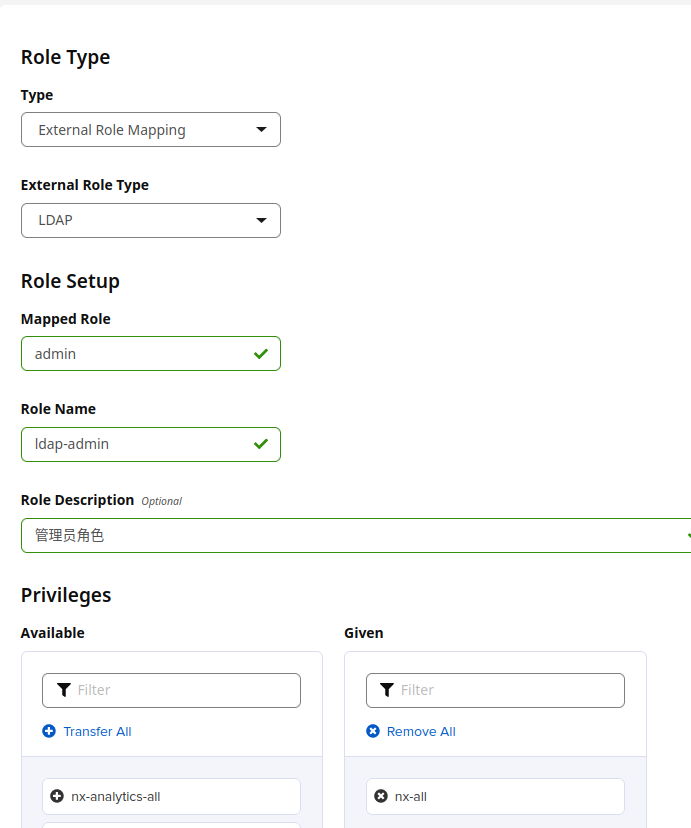
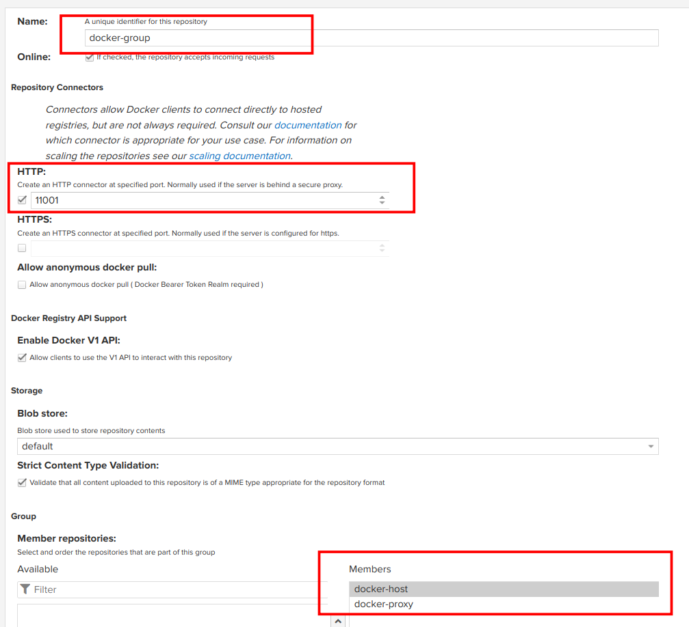

= 部署 Nexus3
:experimental:
:icons: font
:experimental:
:icons: font
:toc: right
:toc-title: 目录
:toclevels: 4
:source-highlighter: rouge

== 说明

Nexus3 项目依赖镜像 `sonatype/nexus3:3.40.1` 和 `nginx:1.21.1`。

== 创建持久卷

导入以下配置，创建持久卷;由于 *Nexus* 要存储 *Docker* 镜像和 *Maven* 编译结果以及 *RPM*/*DEB* 镜像包，可适当调大容量。

[source%linenums,yaml]
----
include::conf/00-nexus-pvc.yaml[]
----

== 创建 Nexus3 Nginx 反向代理配置

由于要配置复杂的分流规则，需要 Nginx ，使用以下配置导入 Nginx 配置。

.点击展开配置
[%collapsible]
====

[source%linenums,yaml]
----
include::./conf/01-nexus-conf-nginx.yaml[]
----

.其中
<1> 此处配置的是 nexus3 web面板的地址
<2> 此处配置的是 Nexus3 Docker Host 的地址
<3> 此处配置的是 Nexus3 Docker Group 的地址

====

== 创建 Nexus3 启动配置

使用以下配置创建 Nexus3 启动配置。

[source%linenums,yaml]
----
include::conf/02-nexus-deploy.yaml[]
----

== 暴露 Nexus3 Service

使用以下配置创建 Nexus3 Service。

[source%linenums,yaml]
----
include::conf/03-nexus-service.yaml[]
----

== 创建 Ingress 映射

创建 Service 完成后，将其映射到 Ingress 上。

[source%linenums,yaml]
----
include::conf/04-nexus-ingress.yaml[]
----

.其中
<1> 配置Nginx不限制最大上传镜像大小

== 管理 Nexus3

安装完成后，你需要对 Nexus3 进行一些配置。

=== 查看 Nexus3 部署情况

使用以下命令查看 `nexus3` 部署状态。

[source%linenums,bash]
----
kubectl get pods,configmaps,secrets,statefulsets.apps,service,ingress  -n core-app -l app=nexus
----

=== 获取管理员密码

`Nexus3` 密码在程序第一次启动时自动生成 ，可使用以下命令获取密码。

[source%linenums,bash]
----
kubectl exec -it -n core-app pods/sts-nexus-0  --container nexus  -- cat /nexus-data/admin.password
----

得到密码后，访问 `https://nexus.{{var.global.pub-host}}` 来管理。

WARNING: 请将 nexus 的管理员密码设置的足够复杂，以防止被暴力破解！

=== 绑定 LDAP

登陆 Nexus 后，访问 `https://nexus.{{var.global.pub-host}}/#admin/security/ldap` ，添加一个 LDAP 服务。具体配置参加如下图片即可。

其中，密码为 LDAP 用户 `service-account` 的密码。点击按钮验证输入是否正确，验证完成后开始添加绑定。在添加绑定前，你需要在 *LDAP* 下添加 `cn=docker,ou=groups,dc=cluster,dc=local` 的角色，类型为 `groupOfNames` 。

image::images/01.b-bind-ldap.png[title="配置LDAP用户"]

UserFilter 的内容如下所示

[source%linenums,ldif]
----
(|(memberOf=cn=admin,ou=groups,dc=cluster,dc=local)(memberOf=cn=docker,ou=groups,dc=cluster,dc=local)(memberOf=cn=deploy,ou=groups,dc=cluster,dc=local))
----

配置完成后，点击 `Verify user mapping` , 检查是否找到用户和角色。一切无误后保存即可。

=== 绑定角色权限

前往 `https://nexus.{{var.global.pub-host}}/#admin/security/roles` 页面，对LDAP相关的角色进行管理。

==== 绑定管理员

绑定管理员的参考如下，注意配置权限：

==== 绑定Docker用户组

绑定Docker管理员的参考如下，注意配置权限：

image::images/02.b-bind-docker-roles.png[title="绑定Docker角色"]

==== 绑定Deploy用户组

绑定Deploy角色的参考如下，注意配置权限：

image::images/02.c-bind-deploy-roles.png[title="绑定Deploy角色"]

=== 创建 Docker 仓库

前往 `https://nexus.{{var.global.pub-host}}/#admin/repository/repositories`，删除默认创建的所有仓库，然后点击新建，选择 `docker (hosted)`, 创建本地私有仓库。具体配置如下：

image::images/03.a-create-docker-hosted.png[title="创建 Docker 本地仓库"]

在创建时，需与之前 `Nginx` 配置的端口一致。创建完成后，继续创建镜像代理。选择 `docker (proxy)` ，依照如下配置填写。

image::images/03.b-create-docker-proxy.png[title="创建 Docker仓库代理"]

代理创建完成后，需要将两者进行归组。选择 `docker (group)` ,按如下配置填写。

一切完成后，使用以下命令测试配置是否成功。

[source%linenums,bash]
----
# 登陆 docker
docker login registry.{{var.global.pub-host}}
docker pull nginx:1.21.1
docker tag nginx:1.21.1 registry.{{var.global.pub-host}}/public/nginx:1.21.1
docker push registry.{{var.global.pub-host}}/public/nginx:1.21.1
----

如果推送一切无误，则表明安装成功。
