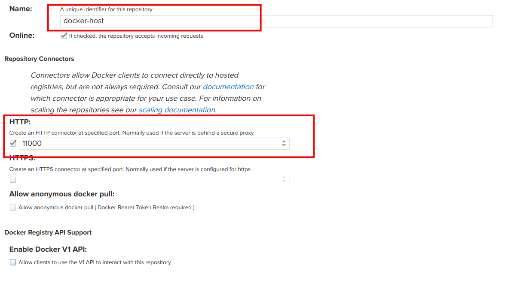

= 部署 Nexus3
:experimental:
:icons: font
:experimental:
:icons: font
:toc: right
:toc-title: 目录
:toclevels: 4
:source-highlighter: rouge

== 说明

Nexus3 项目依赖如下镜像：

[source,text]
----
docker.io/sonatype/nexus3:3.41.1
docker.io/library/nginx:1.21.1
----

部署完成后，将具有以下功能：

* 私有镜像仓库
* 私有 *Maven* 仓库
* 私有 *YUM/DEB* 仓库

其他功能可自行添加

== 部署 Nexus3

=== 创建持久卷

导入以下配置，创建持久卷;由于 *Nexus* 要存储 *Docker* 镜像和 *Maven* 编译结果以及 *RPM*/*DEB* 镜像包，可适当调大容量。

.点击展开配置
[%collapsible]
====

[source,yaml]
----
include::conf/00-nexus-pvc.yaml[]
----
====

=== 创建 Nexus3 Nginx 反向代理配置

由于要配置复杂的分流规则，需要 Nginx 容器完成流量 ，使用以下配置导入 Nginx 配置。

.点击展开配置
[%collapsible]
====

[source,yaml]
----
include::./conf/01-nexus-conf-nginx.yaml[]
----

.其中
<1> 此处配置的是 nexus3 web面板的地址
<2> 此处配置的是 Nexus3 Docker Host 的地址
<3> 此处配置的是 Nexus3 Docker Group 的地址

====

=== 创建 Nexus3 启动配置

使用以下配置创建 Nexus3 启动配置。

.点击展开配置
[%collapsible]
====

[source,yaml]
----
include::conf/02-nexus-deploy.yaml[]
----

====

=== 暴露 Nexus3 Service

使用以下配置创建 Nexus3 Service。

.点击展开配置
[%collapsible]
====

[source,yaml]
----
include::conf/03-nexus-service.yaml[]
----

====

=== 创建 Ingress 映射

创建 Service 完成后，将其映射到 Ingress 上。

.点击展开配置
[%collapsible]
====

[source,yaml]
----
include::conf/04-nexus-ingress.yaml[]
----

.其中
<1> 配置Nginx不限制最大上传镜像大小

====

== 管理 Nexus3

部署完成后，你需要对 Nexus3 进行一些配置。

=== 查看 Nexus3 部署情况

使用以下命令查看 `nexus3` 部署状态。

[source,bash]
----
kubectl get pods,configmaps,secrets,statefulsets.apps,service,ingress  -n core-app -l app=nexus
----

=== 获取管理员密码

`Nexus3` 密码在程序第一次启动时自动生成 ，可使用以下命令获取密码。

[source,bash]
----
kubectl exec -it -n core-app pods/sts-nexus-0  --container nexus  -- cat /nexus-data/admin.password
----

得到密码后，访问 `https://nexus.{{var.global.private.host}}` 来管理。

WARNING: 请将 nexus 的管理员密码设置的足够复杂，以防止被暴力破解！

=== 绑定 LDAP

登陆 Nexus 后，访问 `https://nexus.{{var.global.private.host}}/#admin/security/ldap` ，添加一个 LDAP 服务。具体配置参加如下图片即可。

image::images/01.a-bind-ldap.png[title="配置LDAP连接"]

其中，密码为 LDAP 用户 `service-account` 的密码。点击按钮验证输入是否正确，验证完成后开始添加绑定。

image::images/01.b-bind-ldap.png[title="配置LDAP用户"]

UserFilter 的内容如下所示

[source,ldif]
----
(|(memberOf=cn=admin,ou=groups,dc=cluster,dc=local)(memberOf=cn=oci,ou=groups,dc=cluster,dc=local)(memberOf=cn=package,ou=groups,dc=cluster,dc=local)(memberOf=cn=library,ou=groups,dc=cluster,dc=local)(memberOf=cn=deploy,ou=groups,dc=cluster,dc=local))
----

配置完成后，点击 `Verify user mapping` , 检查是否找到用户和角色。一切无误后保存即可。

=== 绑定角色权限

前往 `https://nexus.{{var.global.private.host}}/#admin/security/roles` 页面，对LDAP相关的角色进行管理。

==== 绑定管理员角色

绑定管理员角色的参考如下，注意配置权限：

image::images/02.a-bind-admin-roles.png[title="绑定管理员角色"]

==== 绑定镜像操作员角色

具有镜像操作员角色的用户可向 Nexus 推送OCI镜像，按如下配置添加即可：

.绑定镜像操作员角色

==== 绑定依赖库操作员角色

具有依赖库操作员角色的用户可向 Nexus 推送相关的依赖包，按如下配置添加即可：

.绑定依赖库操作员

==== 绑定软件包仓库操作员角色

具有软件包仓库操作员角色的用户可向 Nexus 推送相关的软件包，按如下配置添加即可：

.绑定软件包仓库操作员

== 创建仓库

=== 创建 Docker 仓库

前往 `https://nexus.{{var.global.private.host}}/#admin/repository/repositories`，删除默认创建的所有仓库，然后点击新建，选择 `docker (hosted)`, 创建本地私有仓库。具体配置如下：

在创建时，需与之前 `Nginx` 配置的端口一致。创建完成后，继续创建镜像代理。选择 `docker (proxy)` ，依照如下配置填写。

代理创建完成后，需要将两者进行归组。选择 `docker (group)` ,按如下配置填写。

image::images/03.c-create-docker-group.png[title="归组"]

一切完成后，使用以下命令测试配置是否成功。

[source,bash]
----
# 登陆 docker
podman login registry.{{var.global.public.host}}
podman pull docker.io/library/nginx:1.21.1
podman tag docker.io/library/nginx:1.21.1 registry.{{var.global.public.host}}/library/nginx:1.21.1
podman push registry.{{var.global.public.host}}/library/nginx:1.21.1
----

如果推送一切无误，则表明部署成功。

=== 创建 Maven 仓库

前往 `https://nexus.{{var.global.private.host}}/#admin/repository/repositories`，点击新建，选择 `maven2 (hosted)`, 创建本地 snapshots 仓库。具体配置如下：

本地 snapshots 仓库创建完成后，即可开始创建本地 releases 仓库。

本地 snapshots 仓库创建完成后，即可开始创建仓库代理，这里使用的是官方 `maven` 仓库。

最后，组合所有仓库到同一个 Group。

至此，Maven 仓库配置完成。

=== 添加 yum 仓库

前往 `https://nexus.{{var.global.private.host}}/#admin/repository/repositories`，然后点击新建，选择 `yum (hosted)`, 创建本地仓库。具体配置如下：

然后重复之前的步骤，创建 `yum(group)` ( ``yum(proxy)`` 可自行创建)：

其中，需要的 gpg 密钥配置可参考 link:http://links.sonatype.com/products/nxrm3/docs/gpg-signatures-for-yum-proxy-group[Nexus 文档]。

=== 添加 apt 仓库

前往 `https://nexus.{{var.global.private.host}}/#admin/repository/repositories`，然后点击新建，选择 `apt (hosted)`, 创建本地仓库。具体配置如下：

其中，需要的 gpg 密钥配置可参考 link:http://links.sonatype.com/products/nxrm3/docs/gpg-signatures-for-yum-proxy-group[Nexus 文档]。
