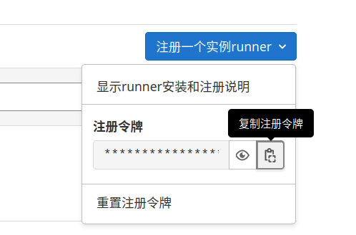

= Gitlab Runner 部署
:experimental:
:icons: font
:experimental:
:icons: font
:toc: right
:toc-title: 目录
:toclevels: 4
:source-highlighter: rouge

WARNING: 注意：在集群内使用 `Gitlab Runner` 可能会导致内部网络暴露，请谨慎使用。

== 说明

*Gitlab Runner* 需要如下镜像：

[source%linenums,text]
----
gitlab-org/gitlab-runner:alpine-v15.2.1
registry.gitlab.com/gitlab-org/gitlab-runner/gitlab-runner-helper:x86_64-32fc1585
----

== 导入 RBAC 规则

由于 *Gitlab Runner* 将使用 `kubernetes` 运行容器，将单独为其创建命名空间 *RBAC* 规则。

.点击展开
[%collapsible]
====

[source%linenums,yaml]
----
include::./conf/00-gitlab-runner-rbac.yaml[]
----

====

== 创建Gitlab配置

前往 `https://gitlab.{{var.global.pub-host}}/admin/runners`,点击右上角，复制注册令牌。

然后修改如下配置文件，将指示位置的令牌修改为你复制的令牌：

[source%linenums,yaml]
----
include::./conf/01-gitlab-runner-conf.yaml[]
----

.其中
<1> 修改为你的令牌内容

== 导入默认内部配置

Gitlab CI 需要指定脚本配置部分配置才可正常运行，此处脚本参考至 link:https://yuyy.info/?p=1921[Gitlab CI/CD 实践一：Gitlab Runner 安装到 K8S 集群]。注意：此配置不支持直接打包 `Docker` 镜像！

.点击展开配置
[%collapsible]
====

[source%linenums,yaml]
----
include::./conf/02-gitlab-runner-internal-conf.yaml[]
----

====

== 导入运行配置

复制并导入以下配置，启动 *Gitlab Runner*。

.点击展开配置
[%collapsible]
====

[source%linenums,yaml]
----
include::./conf/03-gitlab-runner-app.yaml[]
----

====
