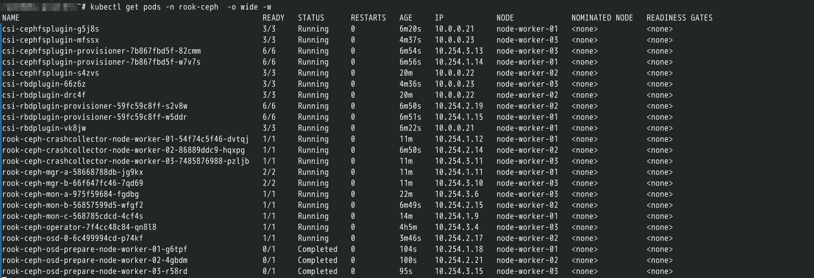

= Rook Ceph 部署
:experimental:
:icons: font
:experimental:
:icons: font
:toc: right
:toc-title: 目录
:toclevels: 4
:source-highlighter: rouge

== 说明

项目地址 : https://rook.github.io/[rook ceph,role="external",window="_blank"],使用 `v1.9.8` 版本。

WARNING:  部署 Ceph 的宿主机需要有未初始化的磁盘

== 导入资源

由于 RookCeph 的配置过于庞大，不便于在此展示，可将文件 link:conf/01-resource.yaml[conf/01-resource.yaml] 推送到控制节点，再使用 `kubectl apply -f 01-resource.yaml` 导入资源 （此资源文件来自官方 `crds.yaml` 、`common.yaml` 和 `operator.yaml` 组合而成）。

导入完成后，使用以下命令查看结果并 Pod 启动完成：

[source,bash]
----
kubectl get pods -n rook-ceph
----

启动完成后，为需要装载 Ceph 的节点打上标签,让 Rook-Ceph 将服务部署在对应节点上。

[source,bash]
----
kubectl label node node-worker-01  role=storage-node
kubectl label node node-worker-02  role=storage-node
kubectl label node node-worker-03  role=storage-node
# 查看标签
kubectl get nodes -L role
----

== 创建 Ceph 集群

导入以下配置，创建 `Ceph` 集群

.点击展开配置
[%collapsible]
====

[source,yaml]
----
include::./conf/02-cluster.yaml[]
----

.其中
<1> 根据前方配置的标签选择对应的节点部署
<2> 选择合适的节点上合适的磁盘作为存储
<3> 表示选择节点名称为 `node-worker-01` 节点

====

WARNING: 请根据自己的服务器配置自行调整！否则将可能对系统造成不可逆的破坏！

部署完成后，执行以下命令，如无问题，将得到如图一所示的结果：

[source,yaml]
----
kubectl get pods -n rook-ceph  -o wide
----

== 部署 Ceph Toolbox

导入以下配置，部署 `ceph-toolbox`。

[source,yaml]
----
include::conf/03-ceph-toolbox.yaml[]
----

部署完成后 ，使用如下命令进入控制台。

[source,bash]
----
kubectl -n rook-ceph exec -it deploy/rook-ceph-tools -- bash
----
